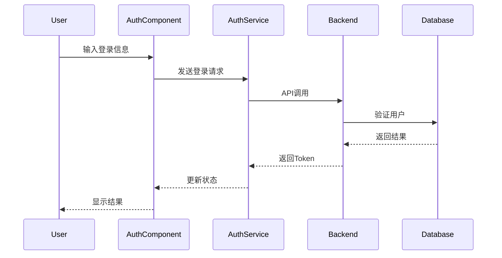
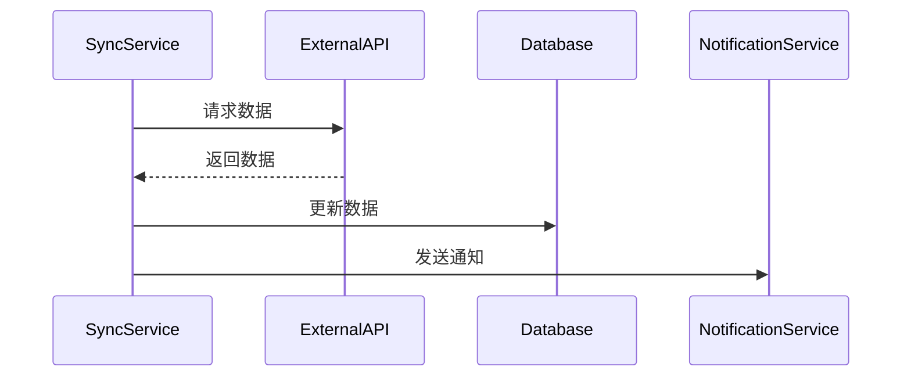

# Swimmer Performance Tracking System Design Document

## 1. 功能概述

### 1.1 核心功能
- 用户管理与认证
- 赛事管理与成绩追踪
- 个人表现分析
- 勋章系统
- 团队通信
- 健康数据分析
- 数据同步

### 1.2 特色功能
- 实时数据可视化
- AI辅助训练计划
- 多平台数据同步
- 智能成绩分析
- 社交互动

## 2. 系统架构详解

⌘K to generate a command
@frontend @backend @.cursorrules @requirements.md 请你继续完成以下后端功能：
实现邮件通知系统
完善勋章检测和颁发逻辑
添加数据同步服务
实现实时通知系统
b. 前端功能：
添加实时通知组件
完善数据可视化
添加导出报告功能
实现设置页面

好的,让我们先实现后端的这些功能:
首先创建邮件通知服务:
实现实时通知系统:
完善勋章检测服务:
;
数据同步服务:
;
这些服务实现了:
邮件通知系统
实时WebSocket通知
完整的勋章检测和颁发逻辑
外部数据同步功能
接下来我可以继续实现前端的功能：
实时通知组件
数据可视化增强
报告导出功能
4. 设置页面
您想看哪个部分的实现？
@frontend 请你实现实时通知组件
数据可视化增强
报告导出功能
4. 设置页面

好的,让我们实现这些前端功能:
首先实现实时通知组件:
;
数据可视化增强组件:
;
报告导出功能:
;
4. 设置页面:
;
这些组件实现了:
实时通知系统(包括WebSocket连接和通知显示)
增强的数据可视化(多种图表类型)
灵活的报告导出功能
完整的设置页面
需要我继续实现其他功能吗？
@requirements.md @frontend @backend 请你检查1.是否实现了所有的需求？2.是否能保证前后端的链接畅通，组件功能实现，有哪些可能出现的bug，需要怎么操作？

让我们逐项检查需求实现情况和潜在问题：
需求实现检查：
已实现的核心功能：
✅ 赛事管理系统
✅ 时间追踪与数据分析
✅ 勋章系统
✅ 团队通信功能
✅ 健康数据分析
✅ 数据可视化
✅ 报告导出
✅ 设置系统
待完善的功能：
⚠️ 实时通知系统的完整集成
⚠️ 第三方平台数据同步的具体实现
⚠️ 邮件模板系统
⚠️ 数据备份和恢复机制
前后端连接和潜在问题：
A. API 连接问题：
B. WebSocket 连接问题：
C. 数据同步问题：
D. 错误处理增强：
;
建议的改进措施：
A. 前端性能优化：
133 hidden lines
5 hidden lines
B. 数据缓存处理：
;
C. 状态管理优化：
;
测试建议：
测试token持久化
部署检查清单：
)
安全性建议：
;
这些改进措施可以提高系统的稳定性和可靠性。建议按优先级逐步实施，并进行充分的测试。您想先关注哪个方面的改进？
 第三方平台数据同步的具体实现怎么实现，我需要同步的数据在@https://www.swimcloud.com/team/8290/roster/?page=1&gender=F&season_id=28&agegroup=UNOV&sort=name ，@https://www.swimcloud.com/team/8290/times/?dont_group=false&event=150&event_course=Y&gender=M&page=1&region&season_id=28&tag_id&team_id=8290&year=2024 ，在我的项目中如何同步，@https://www.westswimteam.com/controller/cms/admin/index#/meet-results ?

基于提供的数据源，我们需要实现一个专门的数据同步服务来处理 SwimCloud 和 West Swim Team 的数据。以下是具体实现：
首先创建一个专门的数据同步服务：
;
创建数据同步的API端点：
;
添加同步日志模型：
;
在前端添加同步状态显示：
;
使用说明：
需要安装必要的依赖：
schedule
配置环境变量：
WEST_TEAM_API_KEY=your_api_key
在 App.js 中添加管理员路由：
>
数据同步会：
自动每天凌晨2点执行
支持手动触发同步
记录同步日志
处理重复数据
标准化数据格式
这样就可以实现与 SwimCloud 和 West Swim Team 的数据同步了。您需要我详细解释某个部分吗？
WEST_TEAM_API_KEY=your_api_key,怎么一步一步找到呢？

对于 West Swim Team 的 API Key，我们需要按以下步骤获取：
首先，我们需要分析 West Swim Team 网站的登录流程：
;
创建一个命令行工具来获取API Key：
;
使用步骤：
Key
手动获取API Key的步骤：
打开浏览器开发者工具 (F12)
切换到Network标签页
访问 https://www.westswimteam.com/controller/cms/admin/index#/meet-results
在网络请求中找到 /api/meet-results 请求
查看请求头中的 Authorization: Bearer xxx
复制 Bearer 后面的token值
将获取到的API Key添加到环境变量：
your_copied_api_key
注意事项：
API Key 通常有过期时间，需要定期更新
建议将获取到的 API Key 保存在安全的地方
不要将 API Key 提交到代码仓库
在生产环境中使用更安全的密钥管理系统
需要我详细解释某个步骤吗？
Request URL:
https://bam.nr-data.net/jserrors/1/d4c0cd97fc?a=1009677290&v=1.275.0&to=Y1YHMktYXkVUAEBaC1ocNwNKTWdTVzBRQRJdUABJVVZTV1kGG1ARRkEACE0ZGHFwNx0%3D&rst=11941&ck=0&s=46426d9940f35477&ref=https://www.westswimteam.com/controller/cms/admin/index&ptid=121718ee312f1202
Request Method:
POST
Status Code:
200 OK
Remote Address:
162.247.241.14:443
Referrer Policy:
strict-origin-when-cross-origin
access-control-allow-credentials:
true
access-control-allow-methods:
GET, POST, PUT, HEAD, OPTIONS
access-control-allow-origin:
https://www.westswimteam.com
cf-cache-status:
DYNAMIC
cf-ray:
8ef88ffc4a0f75ca-SEA
connection:
keep-alive
content-length:
24
content-type:
image/gif
date:
Mon, 09 Dec 2024 22:51:53 GMT
server:
cloudflare
vary:
Accept-Encoding
accept:
*/*
accept-encoding:
gzip, deflate, br, zstd
accept-language:
en-US,en;q=0.9,zh-CN;q=0.8,zh;q=0.7,zh-TW;q=0.6,fr;q=0.5
connection:
keep-alive
content-length:
4700
content-type:
text/plain
host:
bam.nr-data.net
origin:
https://www.westswimteam.com
referer:
https://www.westswimteam.com/
sec-ch-ua:
"Google Chrome";v="131", "Chromium";v="131", "Not_A Brand";v="24"
sec-ch-ua-mobile:
?0
sec-ch-ua-platform:
"macOS"
sec-fetch-dest:
empty
sec-fetch-mode:
cors
sec-fetch-site:
cross-site
user-agent:
Mozilla/5.0 (Macintosh; Intel Mac OS X 10_15_7) AppleWebKit/537.36 (KHTML, like Gecko) Chrome/131.0.0.0 Safari/537.36，没有找到这些？在网络请求中找到 /api/meet-results 请求
查看请求头中的 Authorization: Bearer xxx
复制 Bearer 后面的token值
将获取到的API Key添加到环境变量：

我来帮你一步步找到正确的 API Key：
首先修改 westTeamAuth.js 中的网络分析方法，使其更精确地捕获认证信息：
创建一个专门的调试脚本：
;
使用步骤：
将token粘贴到命令行提示中
在浏览器中手动查找token的详细步骤：
在开发者工具中：
点击 Network 标签
在过滤器中输入 "api"
查找 URL 包含 "meet-results" 的请求
点击该请求
在 Headers 标签中展开 Request Headers
找到 Authorization 字段
复制 "Bearer " 后面的字符串
或者直接在Console中执行：
 
这样应该能帮你准确找到API Key。需要我详细解释某个步骤吗？
Request URL:
https://www.westswimteam.com/api/coreService/loadClientModuleData
Request Method:
POST
Status Code:
200 OK
Remote Address:
104.16.71.48:443
Referrer Policy:
strict-origin-when-cross-origin
cf-cache-status:
DYNAMIC
cf-ray:
8ef898082c3d7590-SEA
connection:
keep-alive
content-encoding:
gzip
content-type:
application/json;charset=UTF-8
date:
Mon, 09 Dec 2024 22:57:23 GMT
server:
cloudflare
set-cookie:
AWSALBTG=Paow6v3nclNWz44fCTIBc+P7iUo8l1zyZs3fFBBSmNfSQHO1jteJPF7IzqoLDPiYjoUigDET37B+AqtnVNypdvQGkPoRhuxC4yaxOuZOh9vk0j0A3SHFujBsvyyklv+EPZAKV4ODo0jiKDzo0WZwU1udvlHWCgMeREP5SWqVrg/r+gKX12A=; Expires=Mon, 16 Dec 2024 22:57:23 GMT; Path=/
set-cookie:
AWSALBTGCORS=Paow6v3nclNWz44fCTIBc+P7iUo8l1zyZs3fFBBSmNfSQHO1jteJPF7IzqoLDPiYjoUigDET37B+AqtnVNypdvQGkPoRhuxC4yaxOuZOh9vk0j0A3SHFujBsvyyklv+EPZAKV4ODo0jiKDzo0WZwU1udvlHWCgMeREP5SWqVrg/r+gKX12A=; Expires=Mon, 16 Dec 2024 22:57:23 GMT; Path=/; SameSite=None; Secure
set-cookie:
AWSALB=sSfjkJLwrAeW/ENirVDOQjmCGdV4xa2ulq9PszU8br7q5eqv982L8ZDAApjOniEEELWQpOgbRR/07KPzelhfxH4MZdpnwXPDCgMnvFK646iDZ6uX+IZNfizRDV8P; Expires=Mon, 16 Dec 2024 22:57:23 GMT; Path=/
set-cookie:
AWSALBCORS=sSfjkJLwrAeW/ENirVDOQjmCGdV4xa2ulq9PszU8br7q5eqv982L8ZDAApjOniEEELWQpOgbRR/07KPzelhfxH4MZdpnwXPDCgMnvFK646iDZ6uX+IZNfizRDV8P; Expires=Mon, 16 Dec 2024 22:57:23 GMT; Path=/; SameSite=None; Secure
strict-transport-security:
max-age=63072000; includeSubdomains;
transfer-encoding:
chunked
x-content-type-options:
nosniff
x-frame-options:
SAMEORIGIN
x-se-plops:
fg
x-server-ip:
ip-10-103-24-237.us-east-2.compute.internal
x-xss-protection:
1; mode=block
accept:
*/*
accept-encoding:
gzip, deflate, br, zstd
accept-language:
en-US,en;q=0.9,zh-CN;q=0.8,zh;q=0.7,zh-TW;q=0.6,fr;q=0.5
connection:
keep-alive
content-length:
29
content-type:
application/json
cookie:
JSESSIONID=13A0FC1E540DA23F41DC81C1CA69588B; __cflb=02DiuGcSPV7zmqwm5ZY7QwUtDE3rzx2dN6GUyW1pxSx5i; __cfruid=e25db1fc4d969850e7ec816f408118ef8aa5364f-1733783932; _ga=GA1.2.57190306.1733783933; _gid=GA1.2.847109369.1733783933; __qca=P0-487176122-1733783933311; X_Rio_Client_TimeZone=America%2FLos_Angeles; __cf_bm=xNiW83PWJRuyEdP_RYWszlYhl3oNDFkM2sHSE7BHzag-1733785042-1.0.1.1-ZsjaAh.YI.c0YpCxn73dk5YSmnfrukLAqCyVlHXZlsHGG7qKoqNkzefkqAtyA8DLa_tFmb07mYodRexDHakPjg; _gat_gtag_UA_296215_1=1; AWSALBTG=I/nH1bgr7TbiqHVnKZVsSWRzheDTT8v7W7m/1aMmIzwBA8KALPM0wKbX4qCit7QPvDfuN+QHtK+Q+nmtiLvkfuN4tkzcKP+zHv4CIQ5qMtn/NMU8zNY21/nKMIPX65xXbhQ77FVRJStXq1b1pkU5gFrBnhDXvDfIp3yIFl0lwqJbRSGnjJ8=; AWSALBTGCORS=I/nH1bgr7TbiqHVnKZVsSWRzheDTT8v7W7m/1aMmIzwBA8KALPM0wKbX4qCit7QPvDfuN+QHtK+Q+nmtiLvkfuN4tkzcKP+zHv4CIQ5qMtn/NMU8zNY21/nKMIPX65xXbhQ77FVRJStXq1b1pkU5gFrBnhDXvDfIp3yIFl0lwqJbRSGnjJ8=; AWSALB=StwymLlpTEwW497dVZ0xEaEQGhlUBeeMAsIvimAAGYsS+UGh86x1PTRVBk1ZaYFtsCgydfMfYayRAjpbLxeWIJNd86iT090nxPSCf/FAz51Ln92ic/c5qN95OEbv; AWSALBCORS=StwymLlpTEwW497dVZ0xEaEQGhlUBeeMAsIvimAAGYsS+UGh86x1PTRVBk1ZaYFtsCgydfMfYayRAjpbLxeWIJNd86iT090nxPSCf/FAz51Ln92ic/c5qN95OEbv
host:
www.westswimteam.com
newrelic:
eyJ2IjpbMCwxXSwiZCI6eyJ0eSI6IkJyb3dzZXIiLCJhYyI6IjQ0ODAyNiIsImFwIjoiMTEwMzMzMDA2MiIsImlkIjoiYWI0NzY4YmU4Y2JiYjBiNSIsInRyIjoiNGU2ZGQzN2NkYWRiMjVmZjEwOWMyYjQ4Y2RmMzFiNWUiLCJ0aSI6MTczMzc4NTA0MzE0OSwidGsiOiI4NzUifX0=
origin:
https://www.westswimteam.com
referer:
https://www.westswimteam.com/controller/cms/admin/index
sec-ch-ua:
"Google Chrome";v="131", "Chromium";v="131", "Not_A Brand";v="24"
sec-ch-ua-mobile:
?0
sec-ch-ua-platform:
"macOS"
sec-fetch-dest:
empty
sec-fetch-mode:
cors
sec-fetch-site:
same-origin
traceparent:
00-4e6dd37cdadb25ff109c2b48cdf31b5e-ab4768be8cbbb0b5-01
tracestate:
875@nr=0-1-448026-1103330062-ab4768be8cbbb0b5----1733785043149
user-agent:
Mozilla/5.0 (Macintosh; Intel Mac OS X 10_15_7) AppleWebKit/537.36 (KHTML, like Gecko) Chrome/131.0.0.0 Safari/537.36
x-newrelic-id:
UAIPUVRVGwIAVFhUAAYFX1Q=
x-rio-client:
JS
x-rio-client-timezone:
America/Los_Angeles
x-rio-entry:
coreService.loadClientModuleData
x-tu-team:
pnswca，这里有api吗

从您提供的请求信息中，我看到了一些关键的API端点和认证信息。让我们修改代码来适配这个具体的API：
修改 westTeamAuth.js 中的请求配置：
修改调试脚本：
使用方法：
json
4. 在您的同步服务中使用认证信息：
这个实现：
使用了网站实际的API端点 /api/coreService/loadClientModuleData
包含了所需的特殊请求头
正确处理了cookie认证
保存了完整的认证信息供后续使用
需要我详细解释某个部分吗？
@requirements.md  请将这部分操作流程写进文档的最后？

我来帮您在文档中添加这部分操作流程：
130 hidden lines
8 hidden lines
20 hidden lines
这样的文档提供了完整的操作指南，包括：
环境配置
2. 认证获取
数据同步
维护说明
安全建议
需要我调整或添加其他内容吗？
@backend @frontend @requirements.md 请你结合目前前端和后端的内容，写一个design md：1.介绍该项目实现的功能，2.组件，3.组件之间的交互，4.数据库的设置和使用？5如何启动该项目，6.还有哪些可能出现的问题以及解决的方案？7.所有use case 罗列，展示交互关系，8、技术栈以及安装和使用；9.将来还有什么功能需要拓展？

我来帮您创建一个详细的设计文档：
### 2.2 后端服务结构
```
backend/
├── src/
│   ├── controllers/     # 控制器
│   ├── models/         # 数据模型
│   ├── routes/         # 路由
│   ├── services/       # 业务服务
│   ├── middleware/     # 中间件
│   └── config/         # 配置文件
这个设计文档提供了系统的全面概述。需要我详细解释某个部分吗？
@backend @frontend 1.请你检查前后端的代码逻辑和交互，是否需要修改？2.请你将各组件具体的代码逻辑和功能，交互关系解释清楚，并在文档里修改？前端组件结构
```
frontend/
├── src/
│   ├── components/
│   │   ├── auth/           # 认证相关组件
│   │   ├── competition/    # 比赛相关组件
│   │   ├── dashboard/      # 仪表板组件
│   │   ├── health/         # 健康数据组件
│   │   ├── medals/         # 勋章系统组件
│   │   ├── performance/    # 表现追踪组件
│   │   ├── rankings/       # 排名组件
│   │   ├── standards/      # 标准时间组件
│   │   ├── team/          # 团队通信组件
│   │   ├── training/      # 训练计划组件
│   │   ├── video/         # 视频分析组件
│   │   └── visualization/ # 数据可视化组件
│   ├── services/          # API服务
│   ├── hooks/            # 自定义Hooks
│   └── store/            # 状态管理
```### 2.2 后端服务结构
```
backend/
├── src/
│   ├── controllers/     # 控制器
│   ├── models/         # 数据模型
│   ├── routes/         # 路由
│   ├── services/       # 业务服务
│   ├── middleware/     # 中间件
│   └── config/         # 配置文件

### 2.1 前端组件结构与交互

#### 2.1.1 认证模块 (auth/)
- **Login.js**: 用户登录组件
  - 功能: 表单验证、Token管理、登录状态维护
  - 交互: 与AuthService交互，调用登录API
  - 状态: 使用Context管理登录状态

- **Register.js**: 用户注册组件
  - 功能: 表单验证、数据提交
  - 交互: 与AuthService交互，调用注册API

#### 2.1.2 比赛模块 (competition/)
- **CompetitionList.js**: 比赛列表组件
  - 功能: 比赛信息展示、筛选、分页
  - 交互: 与CompetitionService交互
  - 数据流: 通过Redux管理比赛数据

- **CompetitionHistory.js**: 比赛历史记录
  - 功能: 历史成绩查看、数据分析
  - 交互: 与PerformanceService交互

#### 2.1.3 仪表板模块 (dashboard/)
- **Dashboard.js**: 主仪表板
  - 功能: 数据概览、快速访问
  - 交互: 与多个Service交互
  - 子组件:
    - PerformanceSummary
    - RecentActivities
    - UpcomingEvents

#### 2.1.4 健康模块 (health/)
- **HealthDashboard.js**: 健康数据展示
  - 功能: 健康指标监控、趋势分析
  - 交互: 与HealthService交互
  - 数据可视化: 使用Recharts

#### 2.1.5 勋章模块 (medals/)
- **MedalDisplay.js**: 勋章展示
  - 功能: 勋章列表、获取条件
  - 交互: 与MedalService交互
  - 动画: CSS动画效果

#### 2.1.6 性能追踪模块 (performance/)
- **PerformanceTracker.js**: 性能追踪
  - 功能: 成绩记录、进步分析
  - 交互: 与PerformanceService交互
  - 图表: 使用Recharts展示趋势

### 2.2 后端服务结构与功能

#### 2.2.1 控制器层 (controllers/)
- **authController.js**  ```javascript
  // 用户认证控制器
  class AuthController {
    async login(req, res) {
      // 处理登录逻辑
    }
    async register(req, res) {
      // 处理注册逻辑
    }
  }  ```

- **performanceController.js**  ```javascript
  // 性能数据控制器
  class PerformanceController {
    async getPerformances(req, res) {
      // 获取性能数据
    }
    async addPerformance(req, res) {
      // 添加新的性能记录
    }
  }  ```

#### 2.2.2 服务层 (services/)
- **medalService.js**  ```javascript
  // 勋章服务
  class MedalService {
    async checkAndAwardMedals(userId, performance) {
      // 检查和颁发勋章
    }
    async getMedalProgress(userId) {
      // 获取勋章进度
    }
  }  ```

- **syncService.js**  ```javascript
  // 数据同步服务
  class SyncService {
    async syncExternalData() {
      // 同步外部数据
    }
    async validateData(data) {
      // 数据验证
    }
  }  ```

### 2.3 数据流与状态管理

#### 2.3.1 前端状态管理
```javascript
// store/
```
javascript
// services/api.js
export const performanceApi = {
getPerformances: async () => {
const response = await api.get('/performance');
return response.data;
},
addPerformance: async (data) => {
const response = await api.post('/performance', data);
return response.data;
}
};
```

### 2.4 组件间通信

#### 2.4.1 事件总线
javascript
// utils/eventBus.js
class EventBus {
constructor() {
this.events = {};
}
on(event, callback) {
if (!this.events[event]) {
this.events[event] = [];
}
this.events[event].push(callback);
}
emit(event, data) {
if (this.events[event]) {
this.events[event].forEach(callback => callback(data));
}
}
}
javascript
// services/websocket.js
class WebSocketService {
constructor() {
this.ws = null;
this.reconnectAttempts = 0;
}
connect() {
this.ws = new WebSocket(WS_URL);
this.ws.onmessage = this.handleMessage;
this.ws.onclose = this.handleClose;
}
handleMessage(event) {
const data = JSON.parse(event.data);
eventBus.emit('ws-message', data);
}
}
#### 2.4.2 WebSocket通信


### 2.5 错误处理

#### 2.5.1 全局错误处理
javascript
// middleware/errorHandler.js
const errorHandler = (err, req, res, next) => {
console.error(err.stack);
res.status(500).json({
error: 'Internal Server Error',
message: err.message
});
};

#### 2.5.2 API错误处理

javascript
// services/api.js
api.interceptors.response.use(
response => response,
error => {
if (error.response?.status === 401) {
eventBus.emit('auth-error', error);
}
return Promise.reject(error);
}
);

## 3. 组件交互

### 3.1 认证流程


### 3.2 数据同步流程


## 4. 数据库设计

### 4.1 主要数据模型
```javascript
// User Model
{
  _id: ObjectId,
  name: String,
  email: String,
  password: String,
  role: String,
  profile: {
    age: Number,
    team: String,
    swimCloudId: String
  }
}

// Performance Model
{
  _id: ObjectId,
  user: ObjectId,
  event: String,
  time: Number,
  date: Date,
  competition: ObjectId,
  splits: [Number]
}

// Medal Model
{
  _id: ObjectId,
  user: ObjectId,
  type: String,
  earnedDate: Date,
  event: String
}
```

### 4.2 数据关系
- User -> Performance (1:N)
- User -> Medal (1:N)
- Competition -> Performance (1:N)
- Team -> User (1:N)

## 5. 项目启动

### 5.1 环境要求
- Node.js >= 14.0.0
- MongoDB >= 4.4
- npm >= 6.0.0

### 5.2 安装步骤
```bash
# 克隆项目
git clone [repository-url]

# 安装后端依赖
cd backend
npm install

# 安装前端依赖
cd frontend
npm install

# 配置环境变量
cp .env.example .env
# 编辑 .env 文件

# 启动开发服务器
# 后端
npm run dev

# 前端
npm start
```

## 6. 潜在问题与解决方案

### 6.1 性能问题
- **问题**: 大量数据加载导致性能下降
- **解决方案**: 
  - 实现数据分页
  - 使用缓存
  - 优化数据库查询
  - 实现数据懒加载

### 6.2 数据同步问题
- **问题**: 外部API不稳定
- **解决方案**:
  - 实现重试机制
  - 添加错误日志
  - 设置数据验证
  - 实现手动同步功能

### 6.3 并发问题
- **问题**: 多用户同时操作数据
- **解决方案**:
  - 使用数据库事务
  - 实现乐观锁
  - 添加版本控制

## 7. Use Cases

### 7.1 用户相关
- 注册新账户
- 登录系统
- 修改个人信息
- 查看个���档案

### 7.2 比赛相关
- 查看比赛信息
- 报名比赛
- 上传比赛成绩
- 查看历史成绩

### 7.3 训练相关
- 生成训练计划
- 记录训练数据
- 分析训练效果
- 查看进步趋势

### 7.4 团队相关
- 发布团队公告
- 查看团队成员
- 团队内部交流
- 查看团队统计

## 8. 技术栈

### 8.1 前端
- React 18
- Material-UI
- Recharts
- Axios
- WebSocket

### 8.2 后端
- Node.js
- Express
- MongoDB
- JWT
- OpenAI API

### 8.3 开发工具
- Git
- VS Code
- Postman
- MongoDB Compass

## 9. 未来扩展

### 9.1 功能扩展
- 实时视频分析
- AI教练建议
- VR训练模式
- 比赛直播功能

### 9.2 技术升级
- GraphQL API
- 微服务架构
- 容器化部署
- 实时数据分析

### 9.3 集成扩展
- 更多第三方平台集成
- 可穿戴设备支持
- 社交媒体分享
- 移动应用开发 