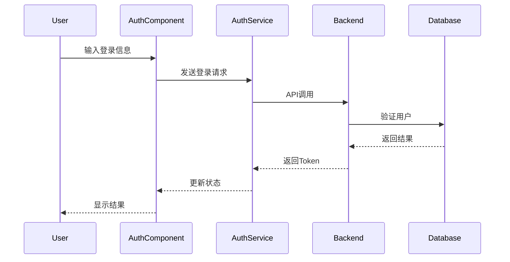
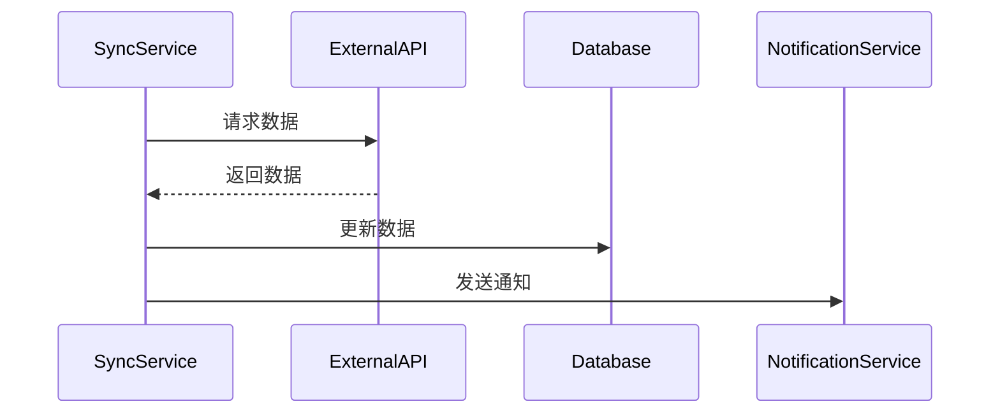

# Swimmer Performance Tracking System Design Document

## 1. 功能概述

### 1.1 核心功能
- 用户管理与认证
- 赛事管理与成绩追踪
- 个人表现分析
- 勋章系统
- 团队通信
- 健康数据分析
- 数据同步

### 1.2 特色功能
- 实时数据可视化
- AI辅助训练计划
- 多平台数据同步
- 智能成绩分析
- 社交互动

## 2. 系统架构详解

### 2.1 前端组件结构与交互

#### 2.1.1 认证模块 (auth/)
- **Login.js**: 用户登录组件
  - 功能: 表单验证、Token管理、登录状态维护
  - 交互: 与AuthService交互，调用登录API
  - 状态: 使用Context管理登录状态

- **Register.js**: 用户注册组件
  - 功能: 表单验证、数据提交
  - 交互: 与AuthService交互，调用注册API

#### 2.1.2 比赛模块 (competition/)
- **CompetitionList.js**: 比赛列表组件
  - 功能: 比赛信息展示、筛选、分页
  - 交互: 与CompetitionService交互
  - 数据流: 通过Redux管理比赛数据

- **CompetitionHistory.js**: 比赛历史记录
  - 功能: 历史成绩查看、数据分析
  - 交互: 与PerformanceService交互

#### 2.1.3 仪表板模块 (dashboard/)
- **Dashboard.js**: 主仪表板
  - 功能: 数据概览、快速访问
  - 交互: 与多个Service交互
  - 子组件:
    - PerformanceSummary
    - RecentActivities
    - UpcomingEvents

#### 2.1.4 健康模块 (health/)
- **HealthDashboard.js**: 健康数据展示
  - 功能: 健康指标监控、趋势分析
  - 交互: 与HealthService交互
  - 数据可视化: 使用Recharts

#### 2.1.5 勋章模块 (medals/)
- **MedalDisplay.js**: 勋章展示
  - 功能: 勋章列表、获取条件
  - 交互: 与MedalService交互
  - 动画: CSS动画效果

#### 2.1.6 性能追踪模块 (performance/)
- **PerformanceTracker.js**: 性能追踪
  - 功能: 成绩记录、进步分析
  - 交互: 与PerformanceService交互
  - 图表: 使用Recharts展示趋势

### 2.2 后端服务结构与功能

#### 2.2.1 控制器层 (controllers/)
- **authController.js**  ```javascript
  // 用户认证控制器
  class AuthController {
    async login(req, res) {
      // 处理登录逻辑
    }
    async register(req, res) {
      // 处理注册逻辑
    }
  }  ```

- **performanceController.js**  ```javascript
  // 性能数据控制器
  class PerformanceController {
    async getPerformances(req, res) {
      // 获取性能数据
    }
    async addPerformance(req, res) {
      // 添加新的性能记录
    }
  }  ```

#### 2.2.2 服务层 (services/)
- **medalService.js**  ```javascript
  // 勋章服务
  class MedalService {
    async checkAndAwardMedals(userId, performance) {
      // 检查和颁发勋章
    }
    async getMedalProgress(userId) {
      // 获取勋章进度
    }
  }  ```

- **syncService.js**  ```javascript
  // 数据同步服务
  class SyncService {
    async syncExternalData() {
      // 同步外部数据
    }
    async validateData(data) {
      // 数据验证
    }
  }  ```

### 2.3 数据流与状态管理

#### 2.3.1 前端状态管理
```javascript
// store/
```

## 3. 组件交互

### 3.1 认证流程


### 3.2 数据同步流程


## 4. 数据库设计

### 4.1 主要数据模型
```javascript
// User Model
{
  _id: ObjectId,
  name: String,
  email: String,
  password: String,
  role: String,
  profile: {
    age: Number,
    team: String,
    swimCloudId: String
  }
}

// Performance Model
{
  _id: ObjectId,
  user: ObjectId,
  event: String,
  time: Number,
  date: Date,
  competition: ObjectId,
  splits: [Number]
}

// Medal Model
{
  _id: ObjectId,
  user: ObjectId,
  type: String,
  earnedDate: Date,
  event: String
}
```

### 4.2 数据关系
- User -> Performance (1:N)
- User -> Medal (1:N)
- Competition -> Performance (1:N)
- Team -> User (1:N)

## 5. 项目启动

### 5.1 环境要求
- Node.js >= 14.0.0
- MongoDB >= 4.4
- npm >= 6.0.0

### 5.2 安装步骤
```bash
# 克隆项目
git clone [repository-url]

# 安装后端依赖
cd backend
npm install

# 安装前端依赖
cd frontend
npm install

# 配置环境变量
cp .env.example .env
# 编辑 .env 文件

# 启动开发服务器
# 后端
npm run dev

# 前端
npm start
```

## 6. 潜在问题与解决方案

### 6.1 性能问题
- **问题**: 大量数据加载导致性能下降
- **解决方案**: 
  - 实现数据分页
  - 使用缓存
  - 优化数据库查询
  - 实现数据懒加载

### 6.2 数据同步问题
- **问题**: 外部API不稳定
- **解决方案**:
  - 实现重试机制
  - 添加错误日志
  - 设置数据验证
  - 实现手动同步功能

### 6.3 并发问题
- **问题**: 多用户同时操作数据
- **解决方案**:
  - 使用数据库事务
  - 实现乐观锁
  - 添加版本控制

## 7. Use Cases

### 7.1 用户相关
- 注册新账户
- 登录系统
- 修改个人信息
- 查看个���档案

### 7.2 比赛相关
- 查看比赛信息
- 报名比赛
- 上传比赛成绩
- 查看历史成绩

### 7.3 训练相关
- 生成训练计划
- 记录训练数据
- 分析训练效果
- 查看进步趋势

### 7.4 团队相关
- 发布团队公告
- 查看团队成员
- 团队内部交流
- 查看团队统计

## 8. 技术栈

### 8.1 前端
- React 18
- Material-UI
- Recharts
- Axios
- WebSocket

### 8.2 后端
- Node.js
- Express
- MongoDB
- JWT
- OpenAI API

### 8.3 开发工具
- Git
- VS Code
- Postman
- MongoDB Compass

## 9. 未来扩展

### 9.1 功能扩展
- 实时视频分析
- AI教练建议
- VR训练模式
- 比赛直播功能

### 9.2 技术升级
- GraphQL API
- 微服务架构
- 容器化部署
- 实时数据分析

### 9.3 集成扩展
- 更多第三方平台集成
- 可穿戴设备支持
- 社交媒体分享
- 移动应用开发 